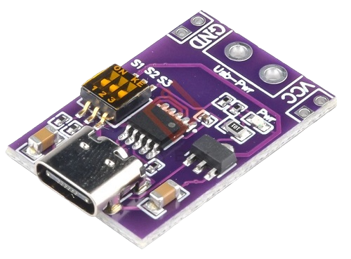

# Welcome to ESP-Robot written in Micropython
***
## Requirements specification:
1. [Overview](#overview)
2. [Wiring](#wiring)
3. [Lego Chassis](#lego-chassis)
4. [Lego DC Motors](#lego-dc-motors)
5. [Hardware](#hardware)
6. [Sensors (HC-SR04)](#sensors)
7. [Light (wb2812b)](#light)
8. [Sound (R2D2 Sounds)](#sounds)
9. [the PROGRAMM](#programm)
10. [ESP Robot Self-Driving Logic](#self-driving)
11. [To-Do's and planning](#to-dos)
***
  
## 1. Overview

mp-remote commands:  
- this command upload the main.py to the micropython board over com11  
`python.exe -m mpremote connect com11 cp main.py :`  
- this command connects to the python prompt over com11  
`python.exe -m mpremote connect com11`  

***
 

## 2. Wiring
***
 

## 3. Lego Chassis
Yes, there are a lot of chassis on the market here. If you look closer, they are only made of sheet metal or fall apart just by looking at them. A modular base is needed - Lego!
The Robot is designed with Studio 2.0, here is the download link:
[Bricklink Studio 2.0](https://www.bricklink.com/v3/studio/download.page)
***
 

## 4. Lego DC Motors
Of course, since the chassis is based on Lego, it's smart to use Lego motors.
2x Power Functions L
Here is the link:  
[Lego Power Functions L](https://www.bricklink.com/v2/catalog/catalogitem.page?S=88003-1)
***
 

## 5. Hardware
this is the hardware from the ESP Robot:
- PD-Delivery Board, with 9V for the L298N
- Bread Board for modular wiring
- Buzzer
- HC-SR04 Ultra Sonic Sensor (for distance)
- L298N Motor Driver
- Microcontroller
- Neopixel LED Strip with 3 LEDs

  
***
 

## 6. Sensors
HC-SR04
***
 

## 7. Light
The Robot defentily need some lights. "A robot needs a light to help it see in the dark, just like how humans need a flashlight!"
So the Robot get some wb2812b LEDs, easy to use and found much in the network. The ESP Robot have a 3 LEDs Strip wb2812b.
It's nice to have an adressable LED or high power LED or small Lasers. When they have 5V, it's easy to use them with a microcontroller.
***
 

## 8. Sound
Beeeep, Bep, Sound. It's very easy to you a piezo buzzer for make some R2D2 noises.
Some small piezo buzzer are avaiable in all electronic onlinestores.
THe R2D2 Sound from main.py is mixxed with the Neopixel LEDs, there are in the same coding loop, and then the light looks soundactiv.  
  
***  
 

## 9. the PROGRAMM
Is the heart of the Robot, without, it's can do nothing!
For some month i learned Python, and so i programmed it in Micropython.
boot.py with Wifi-SSiD and Wifi-Password
main.py with the html website, Motor Speed, R2D2 Sound, Automatic drive (in the earlist Version)
dcmotor.py is the library for the DC Motor, there are the movements inside (forward, left, right, stop)
hcsr04.py is the library for the ultrasonic sensor, the distance is measured in centimeter.  
  
***
 

## 10. ESP Robot Self-Driving Logic
What does the ESP Robot do? 
- Version 1: Forward, >35cm Distance measuring, Stop, Back, Left or Right, Forward again  
  
- some good links and thinkings:  
  - braitenberg-vehikel -> https://de.wikipedia.org/wiki/Braitenberg-Vehikel  
  - SLAM (with 360° Lidar or Linear Lidar, Jetson Board?)
***  
 

## 11. To-Do's and planning:
- [x] new microcontroller ESP32-S2
- [ ] jetson nano / pi
- [ ] new models of the Lego Chassis, there is no end
- [ ] Programming it better, there is no end
- [ ] add some sensors e.g. ESP-Cam, Cam, one more HC-SR04, 360 Lidar, Linear Lidar
- [ ] new self-driving logic's
- [ ] Visualization and Photos
***